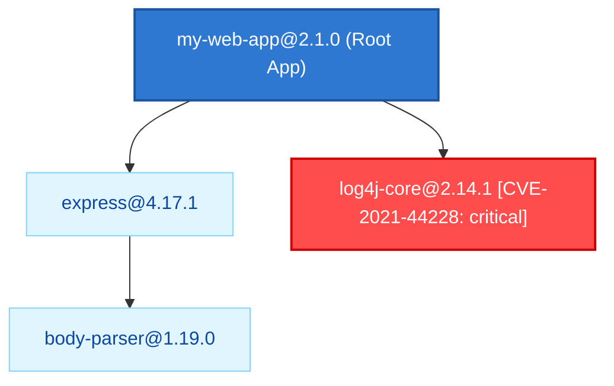
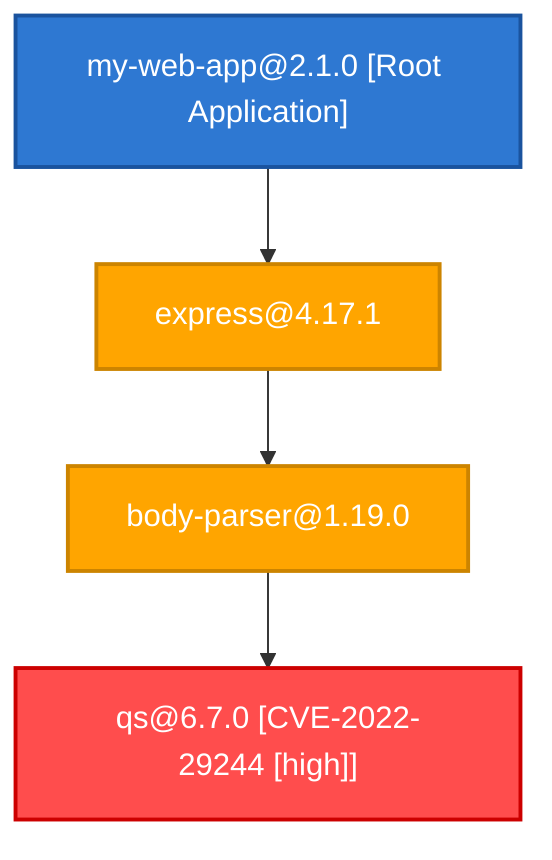

# Usage and Execution Examples

This document collects complete, working examples of the **CycloneDX Query DSL**, illustrating command-line invocation, generated output, and the `--explain` inspection mode.

All examples refer to the CycloneDX 1.4 fixture included in `tests/fixtures/sample_cyclonedx.json`.

---

## Example 1: Basic Query with Filtering and Sorting

### Query (`examples/basic_select.dsl`)
```sql
SELECT name, version, purl
FROM components
IN "tests/fixtures/sample_cyclonedx.json"
WHERE type = 'library'
ORDER BY name ASC;
```

### Execution Command
```bash
./build/sbom-dsl examples/basic_select.dsl
```

### Tabular Output
```
+-------------+---------+------------------------------------------------------+
| name        | version | purl                                                 |
+=============+=========+======================================================+
| body-parser | 1.19.0  | pkg:npm/body-parser@1.19.0                           |
| express     | 4.17.1  | pkg:npm/express@4.17.1                               |
| lodash      | 4.17.21 | pkg:npm/lodash@4.17.21                               |
| log4j-core  | 2.14.1  | pkg:maven/org.apache.logging.log4j/log4j-core@2.14.1 |
| qs          | 6.7.0   | pkg:npm/qs@6.7.0                                     |
+-------------+---------+------------------------------------------------------+
Total: 5 row(s) [Backend: Native CycloneDX Engine, Time: 0.22 ms]
```

### JSON Format Output (`--format json`)
```bash
./build/sbom-dsl examples/basic_select.dsl --format json
```
```json
[
  {
    "name": "body-parser",
    "purl": "pkg:npm/body-parser@1.19.0",
    "version": "1.19.0"
  },
  {
    "name": "express",
    "purl": "pkg:npm/express@4.17.1",
    "version": "4.17.1"
  },
  {
    "name": "lodash",
    "purl": "pkg:npm/lodash@4.17.21",
    "version": "4.17.21"
  },
  {
    "name": "log4j-core",
    "purl": "pkg:maven/org.apache.logging.log4j/log4j-core@2.14.1",
    "version": "2.14.1"
  },
  {
    "name": "qs",
    "purl": "pkg:npm/qs@6.7.0",
    "version": "6.7.0"
  }
]
```

---

## Example 2: Reverse Transitive Closure (`WHO USES`)

### Query (`examples/who_uses.dsl`)
```sql
WHO USES "qs" TRANSITIVE IN "tests/fixtures/sample_cyclonedx.json";
```

### Execution Command
```bash
./build/sbom-dsl examples/who_uses.dsl
```

### Tabular Output
```
+-------------+---------+-------------+----------------------------+----------------------------+
| name        | version | type        | bom-ref                    | purl                       |
+=============+=========+=============+============================+============================+
| body-parser | 1.19.0  | library     | pkg:npm/body-parser@1.19.0 | pkg:npm/body-parser@1.19.0 |
| express     | 4.17.1  | library     | pkg:npm/express@4.17.1     | pkg:npm/express@4.17.1     |
| my-web-app  | 2.1.0   | application | pkg:npm/my-web-app@2.1.0   | -                          |
+-------------+---------+-------------+----------------------------+----------------------------+
Total: 3 row(s) [Backend: Native CycloneDX Engine, Time: 0.21 ms]
```

---

## Example 3: Vulnerability Correlation (`FIND VULNERABLE`)

### Query (`examples/find_vulnerable.dsl`)
```sql
FIND VULNERABLE LIBRARIES
SEVERITY >= HIGH
IN "tests/fixtures/sample_cyclonedx.json";
```

### Execution Command
```bash
./build/sbom-dsl examples/find_vulnerable.dsl
```

### Output
```
+------------+---------+---------+----------------+----------+-------+----------------------+
| name       | version | type    | vuln_id        | severity | score | description          |
+============+=========+=========+================+==========+=======+======================+
| log4j-core | 2.14.1  | library | CVE-2021-44228 | critical | 10.0  | Apache Log4j Core    |
| qs         | 6.7.0   | library | CVE-2022-29244 | high     | 7.5   | A querystring parser |
+------------+---------+---------+----------------+----------+-------+----------------------+
Total: 2 row(s) [Backend: Native CycloneDX Engine, Time: 0.21 ms]
```

---

## Example 4: Dependency Tree (`SHOW TREE`)

### Query (`examples/show_tree.dsl`)
```sql
SHOW TREE OF "my-web-app" DEPTH 2 IN "tests/fixtures/sample_cyclonedx.json";
```

### Command with Tree Format
```bash
./build/sbom-dsl examples/show_tree.dsl --format tree
```

### Hierarchical Output
```
Dependency Tree:
└── express@4.17.1
└── log4j-core@2.14.1
│   └── body-parser@1.19.0
```

### Visual Graph Export (`--format mermaid`)
```bash
./build/sbom-dsl examples/show_tree.dsl --format mermaid
```



---

## Example 5: Blast Radius Analysis (`FIND BLAST RADIUS`)

### Query (`examples/blast_radius.dsl`)
```sql
FIND BLAST RADIUS OF "CVE-2021-44228" IN "tests/fixtures/sample_cyclonedx.json";
```

### Execution Command (Table Format)
```bash
./build/sbom-dsl examples/blast_radius.dsl
```

### Security Summary Output
```
+----------------------------------+-----------------------+
| Metric                           | Value                 |
+==================================+=======================+
| Vulnerability ID                 | CVE-2021-44228        |
| CVSS Severity                    | critical              |
| CVSS Score                       | 10.000000             |
| Total Components in SBOM         | 6                     |
| Directly Affected Components     | 1                     |
| Transitively Impacted Components | 2                     |
| Blast Radius (%)                 | 33.333333%            |
| Root Application Exposed?        | YES (CRITICAL IMPACT) |
+----------------------------------+-----------------------+
Total: 8 row(s) [Backend: Native CycloneDX Engine, Time: 0.12 ms]
```

### Graphical Export with Mermaid (`--format mermaid`)
```bash
./build/sbom-dsl -c "FIND BLAST RADIUS OF 'CVE-2022-29244';" -b tests/fixtures/sample_cyclonedx.json --format mermaid
```



---

## Example 6: Full Compiler Inspection (`--explain`)

### Command
```bash
./build/sbom-dsl -c "SELECT name, version FROM components WHERE type = 'library' IN 'tests/fixtures/sample_cyclonedx.json';" --explain
```

### Detailed Terminal Output
```text
=======================================================
[PHASE 1] LEXICAL ANALYSIS (TOKENS):
=======================================================
  SELECT('SELECT') at <command_line>:1:1
  IDENTIFIER('name') at <command_line>:1:8
  ,(',') at <command_line>:1:12
  IDENTIFIER('version') at <command_line>:1:14
  FROM('FROM') at <command_line>:1:22
  COMPONENTS('components') at <command_line>:1:27
  WHERE('WHERE') at <command_line>:1:38
  IDENTIFIER('type') at <command_line>:1:44
  =('=') at <command_line>:1:49
  STRING('library') at <command_line>:1:51
  IN('IN') at <command_line>:1:61
  STRING('tests/fixtures/sample_cyclonedx.json') at <command_line>:1:64
  ;(';') at <command_line>:1:102
  EOF('') at <command_line>:1:103

=======================================================
[PHASE 2] ABSTRACT SYNTAX TREE (AST):
=======================================================
Program (1 statements):
  SelectStatement:
    Projections: name, version
    Collection: components
    File: tests/fixtures/sample_cyclonedx.json
    Where:
      BinaryOp (=):
        ColumnRef: type
        Literal: "library"

=======================================================
[PHASE 3] SEMANTIC ANALYSIS & TYPE CHECKING:
=======================================================
  Status: PASSED (Schema validated against CycloneDX catalog)

=======================================================
[PHASE 4] LOWERING TO INTERMEDIATE REPRESENTATION (IR):
=======================================================
IR Execution Plan:
  Target SBOM File: tests/fixtures/sample_cyclonedx.json
  Project(columns=[name, version])
    Filter(predicate=[BinaryOp (=):
  ColumnRef: type
  Literal: "library"])
      Scan(collection="components", file="tests/fixtures/sample_cyclonedx.json")

=======================================================
[PHASE 5] TARGET CODEGEN (sbom-utility):
=======================================================
  Mappable to sbom-utility CLI: YES
  Generated Command: sbom-utility query --input-file "tests/fixtures/sample_cyclonedx.json" --from components --select name,version --where "type=library"

=======================================================
[EXECUTION RESULTS]:
=======================================================
+-------------+---------+
| name        | version |
+=============+=========+
| lodash      | 4.17.21 |
| qs          | 6.7.0   |
| log4j-core  | 2.14.1  |
| body-parser | 1.19.0  |
| express     | 4.17.1  |
+-------------+---------+
Total: 5 row(s) [Backend: Native CycloneDX Engine, Time: 0.36 ms]
```

---

## Example 7: String Pattern Matching (`LIKE` and `CONTAINS`)

### Query
```sql
SELECT name, version, purl
FROM components
IN "tests/fixtures/sample_cyclonedx.json"
WHERE name LIKE 'log%' AND purl CONTAINS 'maven';
```

### Execution Command
```bash
./build/sbom-dsl -c "SELECT name, version, purl FROM components WHERE name LIKE 'log%' AND purl CONTAINS 'maven' IN 'tests/fixtures/sample_cyclonedx.json';"
```

### Tabular Output
```text
+------------+---------+------------------------------------------------------+
| name       | version | purl                                                 |
+============+=========+======================================================+
| log4j-core | 2.14.1  | pkg:maven/org.apache.logging.log4j/log4j-core@2.14.1 |
+------------+---------+------------------------------------------------------+
Total: 1 row(s) [Backend: Native CycloneDX Engine, Time: 0.22 ms]
```

### Complex Boolean Pattern Query
```bash
./build/sbom-dsl -c "SELECT name, version FROM components WHERE (name LIKE 'exp%' OR name LIKE '%parser') AND purl CONTAINS 'npm' ORDER BY name ASC;" -b tests/fixtures/sample_cyclonedx.json
```
```text
+-------------+---------+
| name        | version |
+=============+=========+
| body-parser | 1.19.0  |
| express     | 4.17.1  |
+-------------+---------+
Total: 2 row(s) [Backend: Native CycloneDX Engine, Time: 0.15 ms]
```

---

## Example 8: Policy Enforcement & CI/CD Gatekeeping (`ASSERT NO`)

### Scenario A: Compliant Policy (Process Exit Code 0)
Verify that no vulnerability with CVSS score $> 10.0$ exists in the SBOM:
```bash
./build/sbom-dsl -b tests/fixtures/sample_cyclonedx.json -c "ASSERT NO VULNERABILITIES SEVERITY > 10.0;"
echo "Exit Code: $?"
```
```text
[POLICY ASSERTION PASSED] ASSERT NO VULNERABILITIES SEVERITY > 10
Status: COMPLIANT (0 offending records detected in SBOM)
Total: 0 violations [Backend: Native CycloneDX Engine, Time: 0.17 ms]
Exit Code: 0
```

### Scenario B: Policy Violation Detected (Process Exit Code 1)
Enforce that no vulnerability rated `HIGH` or above exists. When violations are detected, the CLI prints the list of offending components/vulnerabilities and exits with `1`:
```bash
./build/sbom-dsl -b tests/fixtures/sample_cyclonedx.json -c "ASSERT NO VULNERABILITIES SEVERITY >= HIGH;"
echo "Exit Code: $?"
```
```text
[POLICY ASSERTION FAILED] ASSERT NO VULNERABILITIES SEVERITY >= HIGH
Status: NON-COMPLIANT (2 offending record(s) found)

+------------+---------+---------+---------+----------+-------+----------------------+
| name       | version | type    | vuln_id | severity | score | description          |
+============+=========+=========+=========+==========+=======+======================+
| log4j-core | 2.14.1  | library |         | critical | 10.0  | Apache Log4j Core    |
| qs         | 6.7.0   | library |         | high     | 7.5   | A querystring parser |
+------------+---------+---------+---------+----------+-------+----------------------+
Total: 2 row(s) [Backend: Native CycloneDX Engine, Time: 0.16 ms]
Exit Code: 1
```

### Scenario C: Component Architectural Policy
Enforce that no component of type `framework` is present:
```bash
./build/sbom-dsl -b tests/fixtures/sample_cyclonedx.json -c "ASSERT NO COMPONENTS WHERE type = 'framework';"
```
```text
[POLICY ASSERTION PASSED] ASSERT NO COMPONENTS
Status: COMPLIANT (0 offending records detected in SBOM)
Total: 0 violations [Backend: Native CycloneDX Engine, Time: 0.11 ms]
```


